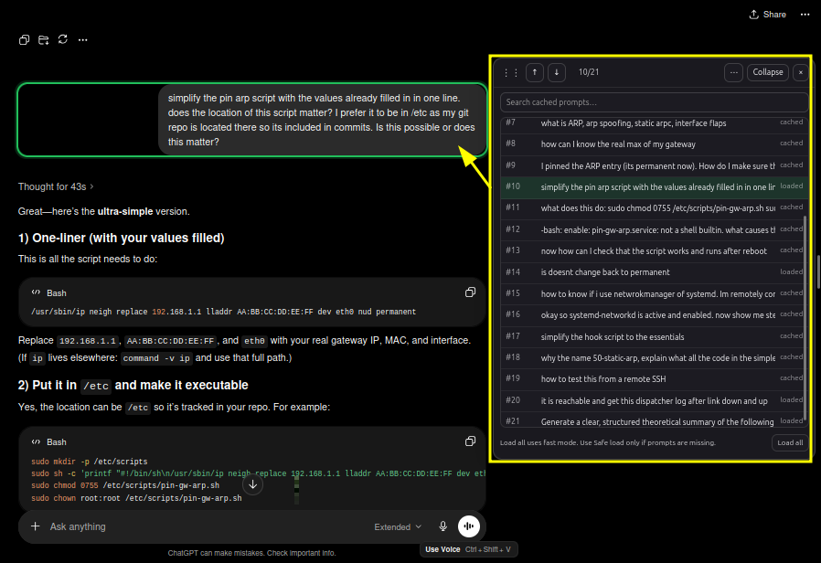
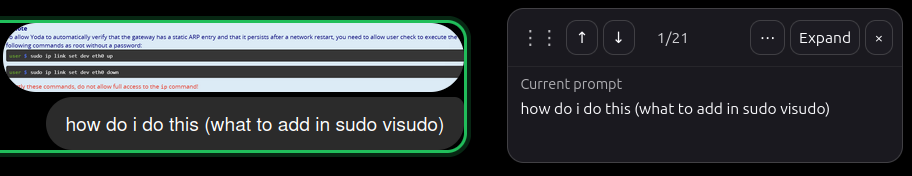
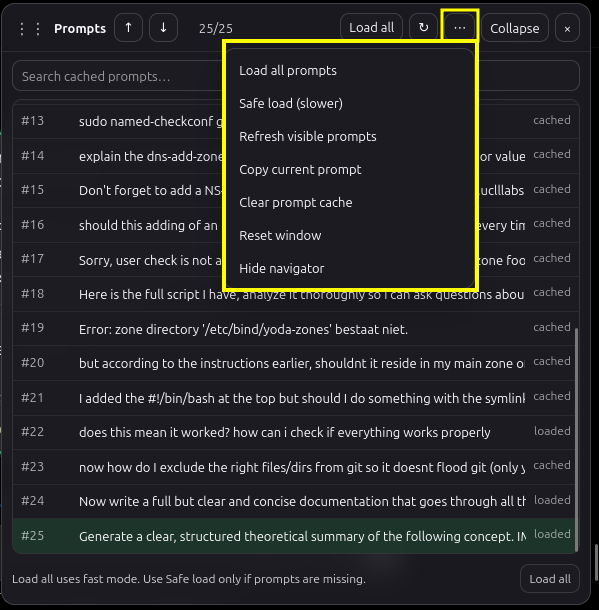

## Install from Greasy Fork (instructions below):

https://greasyfork.org/en/scripts/580189-prompt-otter

# Prompt Otter

**Prompt Otter** is a local userscript that makes long ChatGPT conversations easier to navigate. It highlights your prompts, builds a searchable prompt list, and can load prompts across long virtualized chats so you can jump back to the right part of a conversation faster.

Prompt Otter is designed for ChatGPT on:

- `https://chatgpt.com/*`
- `https://www.chatgpt.com/*`
- `https://chat.openai.com/*`

## Features

- Highlight your prompts inside ChatGPT conversations
- Jump to the previous or next prompt
- Expand a searchable list of cached prompts
- Click any prompt in the list to jump to it
- **Load all** prompts in long chats using the fast default scan
- **Safe load (slower)** fallback for unusually large or slow-loading chats
- Refresh currently visible prompts without clearing the cache
- Copy the current prompt
- Draggable and resizable floating panel
- Collapse, expand, hide, show, reset, and clear cache controls
- Local-only design with no external services

## Installation

### Recommended: Greasy Fork

1. Install a userscript manager such as Tampermonkey, Violentmonkey, or Greasemonkey.
2. Open the Prompt Otter page on Greasy Fork.
3. Click **Install this script**.
4. Confirm the install in your userscript manager.
5. Open or reload ChatGPT.

### Manual install from GitHub

1. Install a userscript manager:
   - Tampermonkey
   - Violentmonkey
   - Greasemonkey
2. Open `prompt-otter.user.js` in this repository.
3. Click **Raw**.
4. Your userscript manager should detect the script.
5. Confirm installation.
6. Open or reload ChatGPT.

## Usage

1. Open a ChatGPT conversation.
2. Use **Expand** to open the prompt list.
3. Click **Load all** in long chats to cache prompts across the conversation.
4. Click a prompt in the list to jump to it.
5. Use the arrow buttons or keyboard shortcuts to move between prompts.
6. Use **Safe load (slower)** from the menu if a very large chat misses prompts.

### Expanded mode

### Collapsed mode

## Controls

| Control | Action |
|---|---|
| **Load all** | Fast scan through the conversation and cache prompts |
| **Safe load (slower)** | Slower fallback scan for difficult chats |
| **Refresh** | Scan currently loaded prompts and add new ones |
| **Expand / Collapse** | Show or hide the full prompt list |
| **↑ / ↓** | Jump to previous or next prompt |
| **Search** | Filter cached prompts |
| **Copy current prompt** | Copy the selected prompt |
| **Clear prompt cache** | Clear cached prompts and rebuild from visible prompts |
| **Reset window** | Reset panel size and position |
| **Hide navigator** | Hide the panel until restored |

### Controls

## Keyboard shortcuts

| Shortcut | Action |
|---|---|
| `Alt + ↑` | Previous prompt |
| `Alt + ↓` | Next prompt |
| `Alt + P` | Hide or show Prompt Otter |

## Privacy

Prompt Otter runs locally in your browser.

It reads the ChatGPT page only to identify your prompts and build the navigation panel. It does **not** send your prompts or chat content to any server. It does not use analytics, tracking, accounts, API keys, or remote code.

Prompt Otter stores only local UI preferences in your browser, such as:

- panel position
- panel size
- expanded or collapsed state
- hidden state
- search text

The prompt cache itself is kept in the page session and is rebuilt as ChatGPT loads conversation content.

## Limitations

- Prompt Otter can only detect prompts that ChatGPT has mounted in the page.
- Long chats may require **Load all** before every prompt can be listed reliably.
- ChatGPT UI changes can temporarily break selectors or scrolling behavior.
- Very large chats may take time to scan, especially with **Safe load (slower)**.

## Troubleshooting

### Prompt Otter does not appear

Check that:

- your userscript manager is installed and enabled
- Prompt Otter is enabled in the userscript manager
- you are on `chatgpt.com` or `chat.openai.com`
- you reloaded the ChatGPT page after installation

### Some prompts are missing

Click **Load all**. If prompts are still missing, open the menu and use **Safe load (slower)**.

### Jumping does not land correctly

Run **Load all** first, then try again. If the issue happens in a very large conversation, use **Safe load (slower)**.

### ChatGPT becomes slow while scanning

Stop the scan or wait for it to finish. **Load all** scrolls through the chat automatically, so very long conversations can temporarily feel busy.

## Development

Prompt Otter is a single-file userscript.

- Main file: `prompt-otter.user.js`
- No build step required
- No external dependencies
- No remote code loading
- License: MIT

For a release:

1. Update the `@version` field in `prompt-otter.user.js`.
2. Update `CHANGELOG.md`.
3. Test on ChatGPT.
4. Publish the updated script to GitHub and Greasy Fork.

## Support

Report bugs or request features through GitHub Issues:

<https://github.com/robinja2200/prompt-otter/issues>

Please include:

- browser name and version
- userscript manager name
- Prompt Otter version
- whether the chat is short or long
- whether **Load all** or **Safe load** was used
- screenshots if helpful, with private chat content removed

## License

MIT License.
